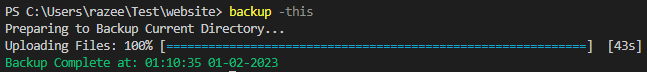
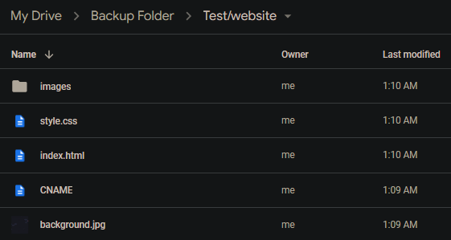
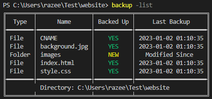
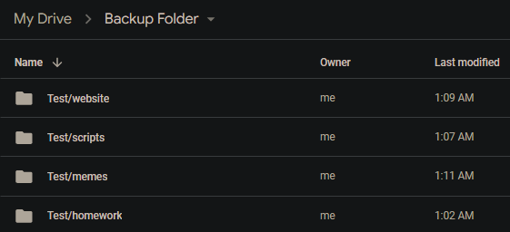
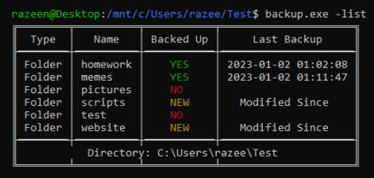

# CLI CLoud Backup Tool

A command-line interface program that allows you to easily back up your local files and folders to your Google Drive. It features a console UI that lists which folders and files are and aren't backed up, it also indicates if any files or folders have been modified since the last backup, making it easy to keep track of your backups and changes.

One of the key features of this tool is the use of goroutines for uploading files, which has increased upload speed by up to 73% in some cases. However, depending on the size of the upload, the user rate limit for the Google Drive API can sometimes act as a bottleneck for the goroutine threads, potentially limiting the overall speed of the backups.

### Usage:
- `backup -list`: Lists all files in the current directory and whether they have been backed up or not.
- `backup -this`: Backs up the current directory.

## Preview

    
Uploading 'Website' Folder to Drive:

      
    
Files are uploaded to Drive following the local file structure:

     
    
List of files in the current directory with backup status and time of each file or folder:

      
    
Example in Ubuntu Bash Shell:

     
     

